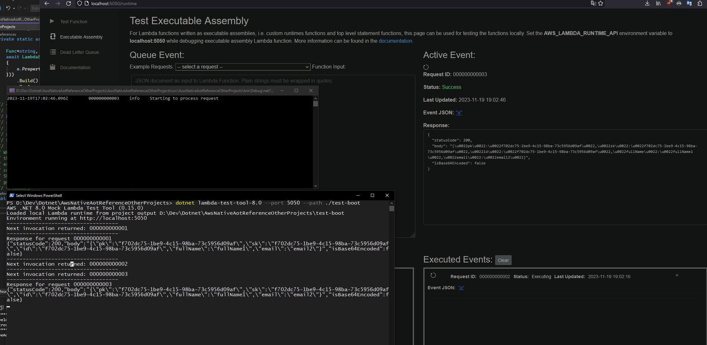

# Goal of the project

To try out .NET AWS Lambda with Native AOT, DI and shared common projects.

Project is made with .NET 7 and uses .NET 7 build image (ECR sam/build-dotnet7).

# Test locally

NB: It's not in AOT and the code working here might produce runtime errors on AWS (could compile without errors).

1. Start "AWS .NET 8.0 Mock Lambda Test Tool" (or whatever version of .NET is installed)

   > dotnet tool install Amazon.Lambda.TestTool-8.0 -g

   > dotnet lambda-test-tool-8.0 --port 5050 --path ./test-boot

   Explanation: Seems that to start lambda-test-tool it needs some built project details to attach itself thus `./test-boot` folder has needed files. In non-assembly mode projects start by providing this `"workingDirectory": ".\\bin\\$(Configuration)\\net7.0"` and it picks up files from there.

2. Once "Mock Lambda Test Tool" is running, assembly type Lambda can be started with such launch profile

   ```json
   {
     "profiles": {
       "Lambda Runtime API": {
         "commandName": "Project",
         "environmentVariables": {
           "AWS_LAMBDA_RUNTIME_API": "localhost:5050"
         }
       }
     }
   }
   ```

3. Then the requests are made from http://localhost:5050/runtime, more about this https://github.com/aws/aws-lambda-dotnet/blob/master/Tools/LambdaTestTool/README.md#testing-executable-assemblies

# Building/deploying for AWS Linux

go to lambda path such as `cd AwsNativeAotReferenceOtherProjects\src\AwsNativeAotReferenceOtherProjects`

- Build with `dotnet lambda package --code-mount-directory ../../../`

- Build & publish with `dotnet lambda deploy-function MyFunctionName --code-mount-directory ..\..\..\`

`--code-mount-directory` is needed to move shared project dirs to Docker container. This Docker container builds .NET app on Amazon Linux 2 (.NET 8 should likely come with Amazon Linux 2023).

# Prevent excessive trimming

rd.xml has files to prevent trimming. It has to be in main lambda as rd.xml being in ./Repository.csproj does not affect what gets trimmed out of DynamoDb SDK.

<Assembly Name="System.Runtime"> and <Assembly Name="System.Collections"> was added due to error https://github.com/aws/aws-sdk-net/issues/2542. This error appears to happen only once I introduced shared ./Repository project, when in it was part of the main Lambda it was working without issues.

# Issues with Mock tool test

- Since I installed .NET 8 SDK, Mock Lambda Test Tool versions 6.0 and 7.0 stopped working (UI shows, but request samples won't load, real calls won't be made) but I can start all existing projects by referencing executable of .NET 8 version

```json
{
  "profiles": {
    "Mock Lambda Test Tool": {
      "commandName": "Executable",
      "commandLineArgs": "--port 5050",
      "workingDirectory": ".\\bin\\$(Configuration)\\net6.0",
      "executablePath": "%USERPROFILE%\\.dotnet\\tools\\dotnet-lambda-test-tool-8.0.exe"
    }
  }
}
```

# Native AOT .NET 7 vs usual .NET 6

Little different project but getCustomer call from DynamoDb. Tested code from https://github.com/Elfocrash/aws-videos/tree/master/NativeAot/NativeAotLambda

| Memory | Request # | AOT                                                                                                               | Casual                                                                                                            |
| ------ | --------- | ----------------------------------------------------------------------------------------------------------------- | ----------------------------------------------------------------------------------------------------------------- |
| 128mb  | 1st       | Duration: 1484.23 ms Billed Duration: 1746 ms Memory Size: 128 MB Max Memory Used: 69 MB Init Duration: 261.09 ms | Duration: 5355.05 ms Billed Duration: 5356 ms Memory Size: 128 MB Max Memory Used: 99 MB Init Duration: 315.31 ms |
| 128mb  | 2nd       | Duration: 15.00 ms Billed Duration: 15 ms Memory Size: 128 MB Max Memory Used: 70 MB                              | Duration: 97.25 ms Billed Duration: 98 ms Memory Size: 128 MB Max Memory Used: 100 MB                             |
| 256mb  | 1st       | Duration: 667.41 ms Billed Duration: 884 ms Memory Size: 256 MB Max Memory Used: 69 MB Init Duration: 216.55 ms   | Duration: 2428.55 ms Billed Duration: 2429 ms Memory Size: 256 MB Max Memory Used: 99 MB Init Duration: 320.14 ms |
| 256mb  | 2nd       | Duration: 5.59 ms Billed Duration: 6 ms Memory Size: 256 MB Max Memory Used: 70 MB                                | Duration: 6.12 ms Billed Duration: 7 ms Memory Size: 256 MB Max Memory Used: 99 MB                                |
| 512mb  | 1st       | Duration: 348.56 ms Billed Duration: 576 ms Memory Size: 512 MB Max Memory Used: 69 MB Init Duration: 227.15 ms   | Duration: 1188.12 ms Billed Duration: 1189 ms Memory Size: 512 MB Max Memory Used: 99 MB Init Duration: 360.70 ms |
| 512mb  | 2nd       | Duration: 6.94 ms Billed Duration: 7 ms Memory Size: 512 MB Max Memory Used: 70 MB                                | Duration: 6.19 ms Billed Duration: 7 ms Memory Size: 512 MB Max Memory Used: 99 MB                                |
| 2048mb | 1st       | Duration: 136.83 ms Billed Duration: 392 ms Memory Size: 2048 MB Max Memory Used: 69 MB Init Duration: 254.90 ms  | Duration: 332.85 ms Billed Duration: 333 ms Memory Size: 2048 MB Max Memory Used: 99 MB Init Duration: 344.67 ms  |
| 2048mb | 2nd       | Duration: 4.09 ms Billed Duration: 5 ms Memory Size: 2048 MB Max Memory Used: 70 MB                               | Duration: 6.34 ms Billed Duration: 7 ms Memory Size: 2048 MB Max Memory Used: 99 MB                               |

# Misc


